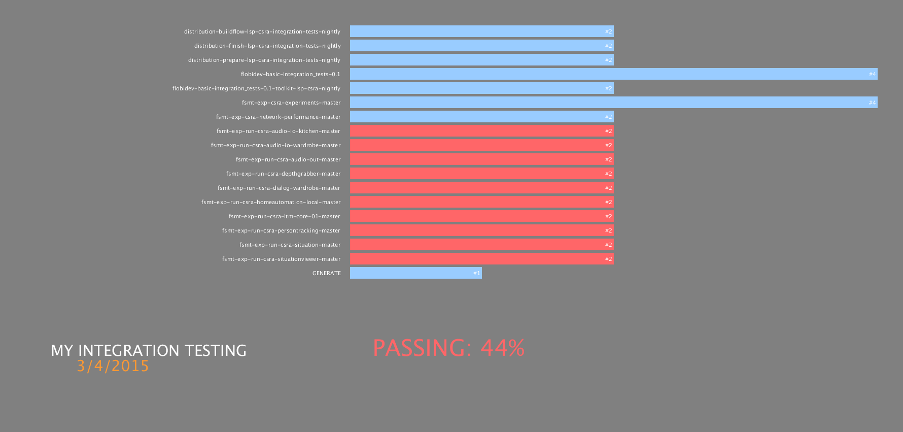

Processing Jenkins Monitor
===========================



Recently, I looked for a way to visualize the statuses of `important` CI build jobs. Since the Jenkins CI Server already provides 
a neat way of aggregating jobs using so-called views, plus providing a convenient REST-like JSON API, I decided to implement this 
tiny visualization application myself using the `Processing <https://processing.org/>`_ framework. The goals of this application 
are simple: i) visualize jobs by displaying the total number of builds and the current build status, and ii) also provide auditory feedback.

That said, this application is `not` meant to display and watch lots of jobs, that's what your Jenkins front-end does. It is more about organizing 
your `most important` jobs using Jenkins views and then display only those jobs in `this` application. You can think of this application as 
a public display (at your office for instance) in order to provide a quick overview for developers.
 
 
Installation
=============

1. mkdir ~/sketchbook
2. git clone this into ~/sketchbook
3. Edit the config.json according to your needs
4. Get the latest release of https://processing.org/, fire it up, and open the Jenkins_Monitor.pde
5. Run it! (press "Play")


Stand-Alone Deployment
=======================

You may also deploy this application as a stand-alone application (no need for Processing). Therefore, you must open it (once) in Processing 
and press CTRL+E (or File --> Export Application). Follow the instructions carefully and you will end up with a new folder containing all the 
necessary files in order to run this application without opening Processing. However, you `MUST` copy the audio folder and config.json file into 
that folder before starting/shipping the application.


Configuration Semantics
========================

```
{
  "server_url": "http://localhost:8181/", # This is where you Jenkins is running
  "view": "INTEGRATION", # The view you want to visualize
  "job_replace_string": "-toolkit-lsp-csra-integration-tests-nightly", # If you have really long jobs names, you may shorten them...
  "title": "MY INTEGRATION TESTING", # The title in the lower left corner
  "title_size": 30, # Obvious I guess
  "spacing": 5, # Spacing between job bars
  "refreshrate": 30, # How often you want to refresh the visualization (in seconds, please don't DOS the Jenkins ;) )
  "sayrate": 1800 # How often do you want the application to "say" the overall build status (in seconds)
}
```

